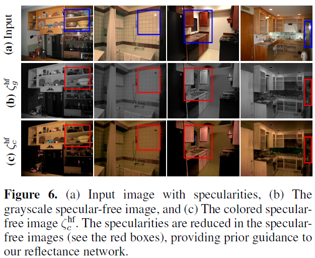

# S-Aware-network (AAAI'2023)

## Introduction
This is an implementation of the following paper.
> [Estimating Reflectance Layer from A Single Image: Integrating Reflectance Guidance and Shadow/Specular Aware Learning.](https://arxiv.org/abs/2211.14751)
> AAAI Conference on Artificial Intelligence, (AAAI'2023)

[[Paper]](https://arxiv.org/pdf/2211.14751.pdf)
[[Poster]](https://www.dropbox.com/s/epc69nk2aqsdi7v/SAware_poster.pdf?dl=0) 
[[Slides]](https://www.dropbox.com/s/7f3j2d5ugifpftv/SAware_ppt.pdf?dl=0) 

## Datasets
### Intrinsic Image Decomposition

1.[IIW](<https://labelmaterial.s3.amazonaws.com/release/iiw-dataset-release-0.zip>) OR [IIW](http://opensurfaces.cs.cornell.edu/publications/intrinsic/)

2.[MIT](https://github.com/davidstutz/grosse2009-intrinsic-images) OR [MIT](http://www.cs.toronto.edu/~rgrosse/intrinsic/downloads.html)

3.[MPI-Sintel](https://www.dropbox.com/s/4p6hlwsv2bv9vgp/MPI_300.zip?dl=0)

4.[ShapeNet](https://www.dropbox.com/s/vzi9cak5kr2obeq/ShapeNet-intrinsic-car-modified.zip?dl=0)
(https://github.com/JannerM/intrinsics-network)


### Shadow Removal

1.SRD ([train](https://drive.google.com/file/d/1W8vBRJYDG9imMgr9I2XaA13tlFIEHOjS/view) [BaiduNetdisk](https://pan.baidu.com/s/1mj3BoRQ) and [test](http://www.shengfenghe.com/publications/)).

2.[AISTD](https://www3.cs.stonybrook.edu/~cvl/projects/SID/index.html) 

### Specularity/highlight Removal
1.[Specularity separation](https://www.dropbox.com/s/awk9fa00xvfeqmf/specular%2Bdataset.zip?dl=0)

2.[ShapeNet]

Renjiao Yi, Ping Tan and Stephen Lin, "Leveraging Multi-view Image Sets for Unsupervised Intrinsic Image Decomposition and Highlight Separation", AAAI 2020.

## Specular-Free Loss
Get the following Figure 6 in the main paper,
<p align="left">
  
</p>

```
demo_spfree_release.m
```

### Citation
If this work is useful for your research, please cite our paper. 
```
@article{jin2022estimating,
  title={Estimating Reflectance Layer from A Single Image: Integrating Reflectance Guidance and Shadow/Specular Aware Learning},
  author={Jin, Yeying and Li, Ruoteng and Yang, Wenhan and Tan, Robby T},
  journal={arXiv preprint arXiv:2211.14751},
  year={2022}
}
```
